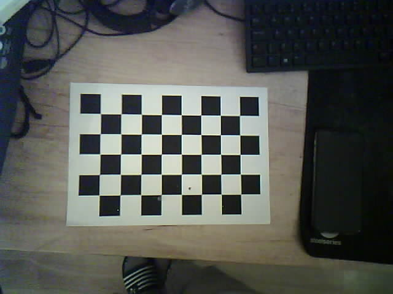
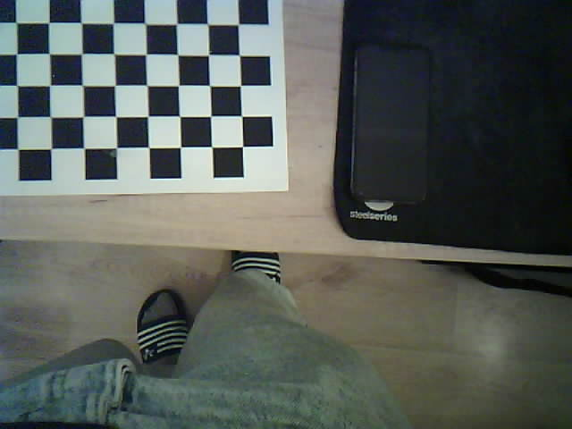
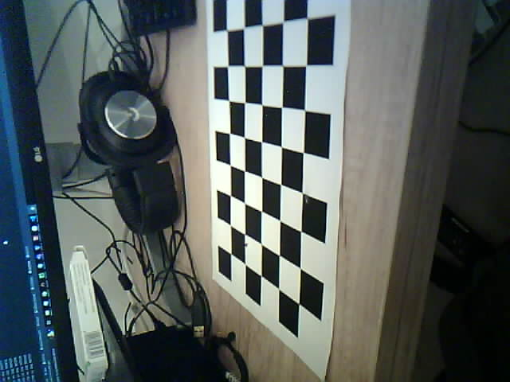

# Camera Calibration
This repository contains a code that can be used to calibrate an ESP32 camera. The implementation of the `cam` package that is used here to get frames from the camera may or may not need to be modified to comply to the camera you are using.

## Installation
After cloning the repository simply run `pip install -r requirements.txt` and you're all set to go.

## Running demonstration
Run script `calibration.py` - it will take all the example images from `screenshots/` directory and perform a camera calibration based on them. After the calibration the program will draw a raw realtime stream of frames from the camera and below it a rectified version of the same stream after applying the calibration.

## Performing the Calibration
First off you need to print the [chessboard calibration pattern](calib_pattern.pdf). Then run the `image_capture.py` script and using spacebar capture around 20 images of the chessboard from different angles and using different parts of the camera screen. These images will be saved to `screenshots/` directory which already contains a few sample images of the chessboard, so if you want to run a calibration only based on your new images you have to delete them prior to this. Secondly run `calibration.py`. All the images used for the calibration will be displayed one by one with the chessboard pattern drawn on them. After this process you will get stream of frames from your calibrated camera side-by-side to the image from before the calibration for comparison.

## Example
Below are presented images used for calibration:

After running `calibration.py` on those images we get side-by-side view of images before and after calibration (difference is barely visible because the camera used here had already pretty good image prior to calibration):

